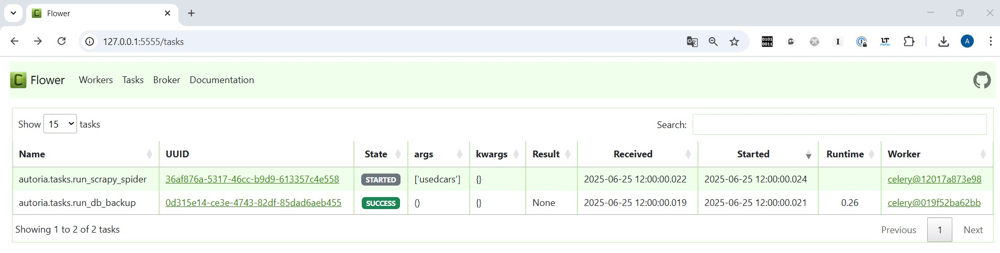

### Scraping Auto Ria site

This project scrapes ads listings of used cars from autoria.com site and saves it to database.

### Features:
- Scrapy framework.

  For accessing some fields (ex. phone_number) used internal Ria api.
 
  It is strongly recommended to use proxy to avoid ip blocking when there is a large flow of requests.

- Scraping App starts everyday at 12:00 (timezone=Europe/Kiev). 
  It analyzes all pages of website pages to find the new created ads to save.

- Dumping db starts daily at 12:00 (timezone=Europe/Kiev). 
  Path to dump files in root: ```backups/```


Applications are deployed in docker containers:
- scrapy apps volume
- celery worker for scraping
- celery worker for dumping
- celery beat cron scheduler
- flower tasks monitoring
- redis as broker
- postgresql db
- db data volume

### Notes: 
* Internal Ria **Api** call is made asynchronously according to native scrapy.   
* **Settings** and **Throttles** are defined in Scrapy Settings to regulate the frequency of Api and Url calls - to avoid blocking scraping by the Ria platform. 
  * These settings should be updated and optimized for production. 
* Also it can be set custom settings for the Number of feed Pages (SCRAPY_MAX_PAGES_TO_CRAWL)    
  and the Number of car Ads (SCRAPY_MAX_CAR_DETAIL_PAGES), if necessary. 
* For safe scraping, fingerprints are used, for example, real browser **Headers**. 
* For periodic tasks, the **Celery** package is preferred and Celery Beat.   
  It provides reliability and resistance to possible failures, recovery, task monitoring and management.  
  At least compared to using the usual cron jobs of operating system.
* The Scraping Application and the Db Dump Application are launched by Worker's in different containers,    
  which complies with the **SRP** principle and ensures clean management, debugging and monitoring. 
* Monitoring and control are available via **Flower**.

___
### Tech Stack & System requirements :

* Python 3.12+
* Scrapy 
* SqlAlchemy orm
* PostgreSQL Database 
* Celery
* Redis (used as a Broker & Backend)
* Flower (monitoring)
* Docker Containerization

---

### Run with Docker containers
 System requirements:

* **Docker Desktop 4.+**

Run project:
```
docker-compose up --build
```

Please note:
   * Copy [.env.sample](.env.sample) file to **.env** & set environment variables 


#### Tasks monitoring - Access Flower / Celery tasks monitoring
   - [http://127.0.0.1:5555/tasks/](http://127.0.0.1:8000/5555/tasks/)

### Demo

### Contact
Feel free to contact: u123@ua.fm
